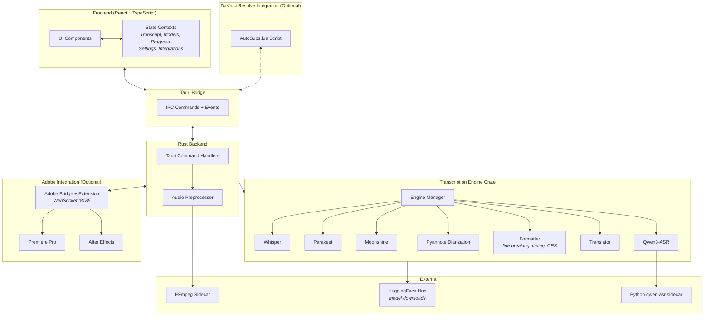

# AutoSubs App

A cross-platform desktop app for generating subtitles with speaker diarization, translation, DaVinci Resolve integration, and Adobe Premiere Pro / After Effects integration via the bundled CEP extension, powered by AI transcription models running locally on your machine.

这个目录是桌面应用本体，包含前端、Tauri 桥接、Rust 后端和当前 fork 的 Qwen3-ASR 集成。若只想使用当前仓库，优先看根目录 `README.md`；本文件保留应用目录内开发和构建说明。



**How a transcription works end-to-end:**

1. User selects a file and clicks Transcribe
2. Rust backend preprocesses audio via FFmpeg
3. Transcription engine runs the chosen local AI model
4. Optionally runs Pyannote diarization and translation
5. Formatter applies line-breaking, timing constraints, and language-specific rules
6. Results stream back to the UI in real time; user edits and exports

## Key Directories

| Directory | Purpose |
|---|---|
| `src/` | React frontend: components, contexts, hooks, utilities |
| `src/components/` | UI organized by feature |
| `src/contexts/` | Global state management |
| `src-tauri/src/` | Rust backend: Tauri commands, audio preprocessing, logging |
| `src-tauri/crates/transcription-engine/` | Core engine: transcription, diarization, formatting, translation |
| `src-tauri/crates/transcription-engine/src/engines/` | Model-specific implementations |
| `src-tauri/resources/` | DaVinci Resolve Lua script, Adobe CEP extension resources, subtitle templates, Qwen sidecar |

## Model Cache Location

AI transcription models are downloaded to the app's cache directory. The location varies by platform:

- **macOS**: `~/Library/Caches/com.autosubs/models`
- **Linux**: `~/.cache/com.autosubs/models` or `$XDG_CACHE_HOME/com.autosubs/models`
- **Windows**: `%LOCALAPPDATA%\com.autosubs\models`

## 安装教程

## Command Line (headless)

AutoSubs can run from the terminal without opening a window, so AI agents and
terminal-heavy users can transcribe files directly. Given a file argument the app
runs headlessly, prints the result, and exits with a status code (`0` success,
`1` on a runtime error, `2` on a usage error). With **no** arguments it launches the
normal desktop interface.

```bash
# Readable transcript to the console (default format)
autosubs interview.mp4 --model small

# Speaker diarization (adds "Speaker N:" labels)
autosubs interview.mp4 --diarize --max-speakers 2 --lang en

# Pick a format explicitly…
autosubs interview.mp4 -f srt
autosubs interview.mp4 -f json

# …or let the output file extension decide
autosubs interview.mp4 -o subs.srt
autosubs interview.mp4 -o transcript.json

# Full option list / version
autosubs --help
autosubs --version
```

**Output formats** (`-f` / `--format`):

| Format | Contents |
|---|---|
| `text` *(default)* | Readable transcript — `[HH:MM:SS] Speaker N: …`, one paragraph per speaker turn (no word-level timings) |
| `srt` | SubRip subtitles (one short cue per segment) |
| `vtt` | WebVTT subtitles (one short cue per segment) |
| `json` | Full structured transcript including word-level timestamps |

If `--format` is omitted, the format is inferred from the `-o` file extension
(`.srt`, `.vtt`, `.json`, `.txt`), otherwise it defaults to `text`.

**stdout** carries only the rendered output, so `autosubs file.mp4 -f srt > out.srt`
is clean and pipe-safe. Progress and errors go to **stderr**: in an interactive
terminal you get a live progress bar with the current stage (downloading model /
transcribing / diarizing / translating); when stderr is piped or captured, it falls
back to one line per stage. On failure a `{ "error": "..." }` object is printed to
stderr and the exit code is non-zero. Models are downloaded automatically on first
use to the [model cache](#model-cache-location).

> On Windows, release builds attach to the parent console at startup so output is
> visible. As with any Tauri CLI app, the shell prompt may return before output
> finishes printing.

### Getting the `autosubs` command on your PATH

The CLI is the same binary as the desktop app, so it needs to be reachable from
your shell:

- **Linux** — already done. The `.deb`/`.rpm` installs `/usr/bin/autosubs`, which is
  on `PATH`. Just run `autosubs <file> ...`.
- **macOS / Windows** — open **Settings → Command line** in the app and click
  **Install**. This symlinks the command into `/usr/local/bin` (macOS, prompts for
  your password) or adds the install folder to your user `PATH` (Windows). **Remove**
  reverses it. The button reports the current state on each platform.

During development the headless binary is at
`src-tauri/target/debug/autosubs` (run `cargo build` in `src-tauri` first); symlink it
yourself with `ln -s "$(pwd)/src-tauri/target/debug/autosubs" /usr/local/bin/autosubs`.

## Getting Started

### 1. 安装前端依赖

```powershell
cd AutoSubs-App
npm install
```

### 2. 安装 Windows 构建依赖

```powershell
winget install Rustlang.Rustup
winget install Kitware.CMake
python -m pip install libclang
```

设置 `LIBCLANG_PATH`：

```powershell
$env:LIBCLANG_PATH = "$env:APPDATA\Python\Python314\site-packages\clang\native"
```

如果你要启用当前仓库的 Windows feature 构建，还需要 Vulkan SDK，并保证 `VULKAN_SDK` 已设置。

### 3. 创建 Python 3.12 虚拟环境

```powershell
py -3.12 -m venv .venv
```

### 4. 安装 `qwen-asr`

```powershell
.\.venv\Scripts\python.exe -m pip install --upgrade pip
.\.venv\Scripts\python.exe -m pip install -U qwen-asr
```

如果你要让 Qwen 使用 GPU，安装 CUDA 版 PyTorch：

```powershell
.\.venv\Scripts\python.exe -m pip uninstall -y torch torchvision torchaudio
.\.venv\Scripts\python.exe -m pip install --upgrade --force-reinstall torch torchvision torchaudio --index-url https://download.pytorch.org/whl/cu128
.\.venv\Scripts\python.exe -m pip install --upgrade --force-reinstall "huggingface_hub==0.36.2"
```

### 5. 下载 Qwen 模型

当前应用默认使用这个缓存目录：

```text
C:\Users\33287\AppData\Local\com.autosubs\models
```

安装 Hugging Face CLI：

```powershell
.\.venv\Scripts\python.exe -m pip install -U "huggingface_hub[cli]"
```

下载模型：

```powershell
$env:HF_HOME = "C:\Users\33287\AppData\Local\com.autosubs\models"
$env:HF_HUB_CACHE = "C:\Users\33287\AppData\Local\com.autosubs\models"
$env:TRANSFORMERS_CACHE = "C:\Users\33287\AppData\Local\com.autosubs\models"

.\.venv\Scripts\huggingface-cli.exe download Qwen/Qwen3-ASR-1.7B
.\.venv\Scripts\huggingface-cli.exe download Qwen/Qwen3-ForcedAligner-0.6B
```

### 6. 启动开发版

```powershell
npm run dev:win
```

### 7. 构建当前系统应用

有签名构建：

```powershell
npm run build:win
```

未签名本地构建：

```powershell
$env:AUTOSUBS_SKIP_SIGN = "1"
npm run build:win
```

可执行文件通常在：

```text
src-tauri\target\release\autosubs.exe
```

## Qwen 使用教程

### 1. 选择模型

在模型选择器里选择：

```text
Qwen3-ASR
```

建议语言：

- 中文：`zh`
- 英文：`en`
- 不确定：`auto`

### 2. 术语 / 上下文怎么填

当前应用已经把前端的 `custom_prompt` 接到了 Qwen 官方支持的 `context` 参数。

推荐填写：

- 术语
- 专有名词
- 品牌名
- 缩写
- 易错词

示例：

```text
DaVinci Resolve AutoSubs Fairlight Fusion Render Queue
```

或：

```text
劳熊 狂徒萨满 狂暴重击 非站立状态 开荒
```

不建议写成长篇提示词，例如“请润色”“请改写成书面语”。

### 3. 文本密度

`Text Density` 是字幕排版后处理，不是模型推理能力。

它会影响：

- 每条字幕长度
- 每行字符数
- 更偏短句还是更偏完整句

所以它对 `Whisper` 和 `Qwen3-ASR` 都会生效。

### 4. 当前已验证

当前应用已经验证通过：

- Qwen sidecar 转录可用
- ForcedAligner 时间戳可用
- Rust 集成链路可用
- Tauri 命令入口 smoke test 可用

## 致谢

本目录对应的应用工程基于原始 AutoSubs 继续开发。

特别感谢原作者 **Tom Moroney** 和原始项目：

- `https://github.com/tmoroney/auto-subs`

原项目在本地字幕工作流、DaVinci Resolve 集成和桌面应用结构上提供了坚实基础，当前 Qwen 版本是在这个基础上继续完成的。
