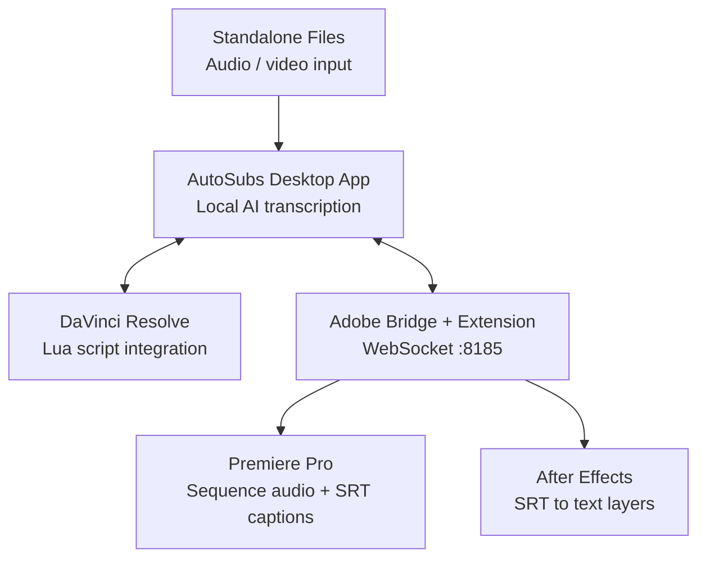

# AutoSubs Chinese

这个仓库基于 [tmoroney/auto-subs](https://github.com/tmoroney/auto-subs) 改造而来，跟进原项目的桌面端、DaVinci Resolve、Premiere Pro / After Effects 集成，同时保留当前 fork 的中文本地化、Windows 构建流程和 `Qwen3-ASR` 集成。

- Transcribes speech in many languages, with optional translation
- Identifies and labels multiple speakers automatically
- Exports to SRT, plain text, DaVinci Resolve, Premiere Pro, or After Effects
- Works standalone, with DaVinci Resolve, or with Adobe apps through the bundled CEP extension
- Adds local Qwen3-ASR support for Chinese transcription workflows

---

Generate Subtitles with Speaker Labels | Animated Captions
:-------------------------:|:-------------------------:
 | 


---

## Integrations



AutoSubs can run as a standalone subtitle generator, connect directly to DaVinci Resolve, or communicate with Adobe Premiere Pro and After Effects through the bundled CEP extension.

> [!WARNING]
> AutoSubs will not work with the Mac App Store version of DaVinci Resolve. Re-install from the [official website](https://www.blackmagicdesign.com/products/davinciresolve/) if needed.

## 安装教程

### 1. 克隆仓库

```powershell
git clone https://github.com/RobetZyarde/auto-subs-chinese
cd auto-subs-chinese/repo/AutoSubs-App
```

### 2. 安装前端依赖

```powershell
npm install
```

### 3. 安装 Rust / Windows 构建依赖

如果你是 Windows 本机开发，至少需要这些环境：

```powershell
winget install Rustlang.Rustup
winget install Kitware.CMake
python -m pip install libclang
```

然后设置 `LIBCLANG_PATH`：

```powershell
$env:LIBCLANG_PATH = "$env:APPDATA\Python\Python314\site-packages\clang\native"
```

如果你要启用当前仓库的 Windows feature 构建，还需要 Vulkan SDK，并保证 `VULKAN_SDK` 已设置到系统环境变量。

### 4. 创建 Python 3.12 虚拟环境

```powershell
py -3.12 -m venv .venv
```

### 5. 安装 `qwen-asr`

```powershell
.\.venv\Scripts\python.exe -m pip install --upgrade pip
.\.venv\Scripts\python.exe -m pip install -U qwen-asr
```

如果要让 Qwen 使用 GPU，请安装 CUDA 版 PyTorch，例如：

```powershell
.\.venv\Scripts\python.exe -m pip uninstall -y torch torchvision torchaudio
.\.venv\Scripts\python.exe -m pip install --upgrade --force-reinstall torch torchvision torchaudio --index-url https://download.pytorch.org/whl/cu128
.\.venv\Scripts\python.exe -m pip install --upgrade --force-reinstall "huggingface_hub==0.36.2"
```

验证 CUDA：

```powershell
.\.venv\Scripts\python.exe -c "import torch; print(torch.__version__); print(torch.version.cuda); print(torch.cuda.is_available()); print(torch.cuda.get_device_name(0) if torch.cuda.is_available() else 'no cuda')"
```

### 6. 下载 Qwen 模型

当前仓库默认读取 AutoSubs 模型缓存目录：

```text
C:\Users\33287\AppData\Local\com.autosubs\models
```

先安装 Hugging Face CLI：

```powershell
.\.venv\Scripts\python.exe -m pip install -U "huggingface_hub[cli]"
```

再把缓存目录指向 AutoSubs，并下载模型：

```powershell
$env:HF_HOME = "C:\Users\33287\AppData\Local\com.autosubs\models"
$env:HF_HUB_CACHE = "C:\Users\33287\AppData\Local\com.autosubs\models"
$env:TRANSFORMERS_CACHE = "C:\Users\33287\AppData\Local\com.autosubs\models"

.\.venv\Scripts\huggingface-cli.exe download Qwen/Qwen3-ASR-1.7B
.\.venv\Scripts\huggingface-cli.exe download Qwen/Qwen3-ForcedAligner-0.6B
```

### 7. 启动开发版

```powershell
npm run dev:win
```

### 8. 构建当前系统应用

有签名构建：

```powershell
npm run build:win
```

未签名本地构建：

```powershell
$env:AUTOSUBS_SKIP_SIGN = "1"
npm run build:win
```

当前可运行的 Windows 可执行文件一般在：

```text
src-tauri\target\release\autosubs.exe
```

## Adobe Premiere Pro / After Effects Mode

1. Launch AutoSubs and open the bundled AutoSubs CEP extension in Premiere Pro or After Effects.
2. Select the Adobe integration from AutoSubs.
3. Export timeline audio for transcription or import generated subtitles back into the host app.
4. In Premiere Pro, subtitles are imported as caption tracks; in After Effects, SRT entries are created as text layers.

## Qwen 使用教程

## Command Line Interface

Transcribe files straight from the terminal. Pass a file and AutoSubs runs without a window, prints the result, and exits; run it with no arguments to open the desktop app as usual.

**1. Add `autosubs` to your PATH**:

- **Linux**: the `.deb` / `.rpm` installs `/usr/bin/autosubs`.
- **macOS / Windows**: in the app, go to **Settings -> Command line** and click **Install**. **Remove** reverses it.

**2. Run it:**

```bash
autosubs interview.mp4 --model small
autosubs interview.mp4 --model small --diarize --max-speakers 2
autosubs interview.mp4 --model small -o subs.srt
autosubs interview.mp4 --model small -f json
autosubs --help
```

`--model` accepts AutoSubs models including Whisper sizes (`tiny` through `large-v3`), `parakeet`, `moonshine-*`, and this fork's `qwen3-asr`. Run `autosubs --list-models` for the full list.

Output formats (`-f` / `--format`, or inferred from `-o`) include `text`, `srt`, `vtt`, and `json`. Result output goes to stdout; progress and errors go to stderr.

### 1. 在应用里选择模型

模型选择器中选择：

```text
Qwen3-ASR
```

语言建议：

- 中文内容：`zh`
- 英文内容：`en`
- 不确定时：`auto`

### 2. 术语 / 上下文提示怎么填

当前仓库已经把前端的 `custom_prompt` 接到了 Qwen 官方支持的 `context` 参数。

最推荐填写的是：

- 关键术语
- 专有名词
- 品牌名
- 缩写
- 容易错听词

示例：

```text
DaVinci Resolve AutoSubs Fairlight Fusion Render Queue
```

或者：

```text
劳熊 狂徒萨满 狂暴重击 非站立状态 开荒
```

不建议写成长篇提示词，例如“请帮我润色”“请改成书面语”这类内容，对 ASR 帮助不稳定。

### 3. 文本密度怎么理解

`Text Density` 不是模型能力，而是字幕后处理排版能力。

它会影响：

- 每条字幕长度
- 每行字符数
- 是否更偏短句或更偏完整句

所以它对 `Whisper` 和 `Qwen3-ASR` 都会生效。

### 4. 已验证的 Qwen 链路

当前仓库已经验证通过：

- Python sidecar 能调用 `Qwen3-ASR`
- `Qwen3-ForcedAligner` 能返回时间戳
- Rust 集成链路能输出带 `words/start/end` 的结果
- Tauri 命令入口能成功跑通 `qwen3-asr` 转录 smoke test

### 5. 推荐测试音频

推荐使用：

- 中文普通讲话
- 带专有名词的视频配音
- 游戏、教程、财经、技术讲解类音频

常见格式都可以：

```text
wav / mp3 / m4a / mp4 / mkv
```

应用会先用 FFmpeg 做标准化处理。

## 致谢

本项目基于原始 AutoSubs 改造而来。

特别感谢原作者 **Tom Moroney** 及其开源项目：

- 原仓库：`https://github.com/tmoroney/auto-subs`

没有原作者在桌面字幕工作流、DaVinci Resolve 集成、Tauri 应用结构和本地转录工程上的工作，这个 Qwen 版本不会这么快落地。
